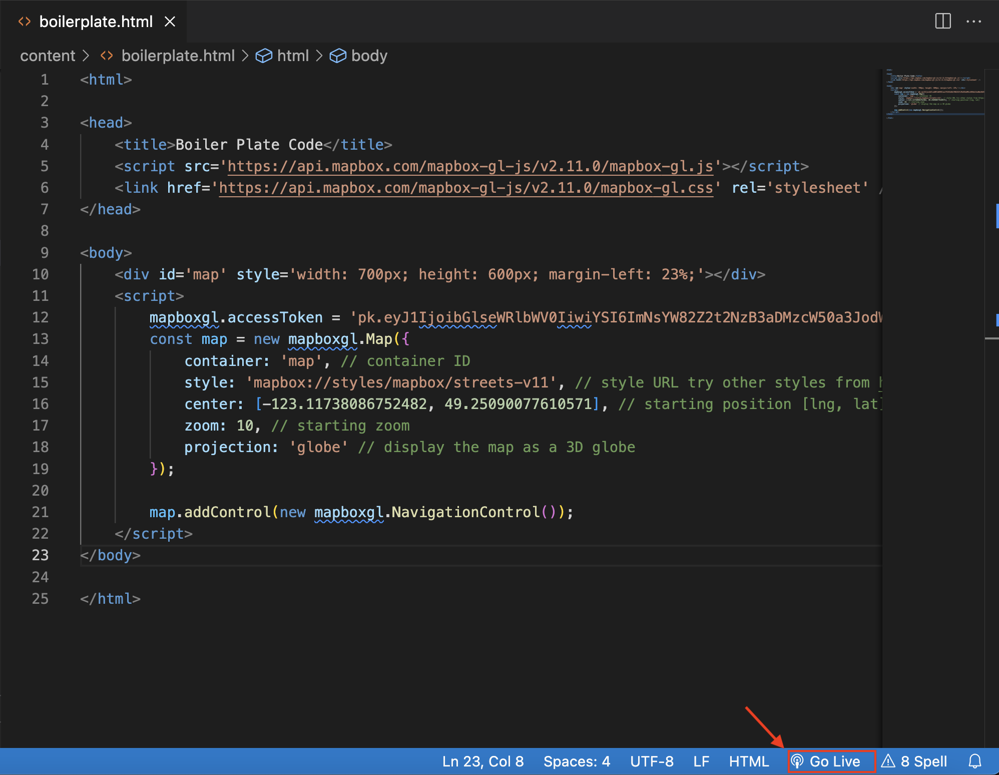

# Build a Cluster Map of Vancouver Parks

Now that you are familiar with the boilerplate code and how it works, the next step is adding and styling data of our own. Below is a preview of the web map we will create using the boilerplate as a basemap. 

<iframe src="./cluster-map.html" style="width: 100%; height: 500px; border:none;"></iframe>
<!-- https://github.com/ubc-library-rc/intro-mapbox/blob/5b582ed327ce2fb6a4a04db4e26ddb6baa819271/content/cluster-map.html -->
    
<br> 
*1*{: .circle .circle-purple}
Open `boilerplate.html` in your code editor. Replace YOUR_ACCESS_TOKEN_HERE with your access token. We will be adding to the `< script>` block using javascript.

If you installed the Live Server extension to Visual Studio Code, in the blue ribbon at the bottom of your code editor there should be an option to "Go Live." Click "Go Live" to open the boilerplate basemap in a web browser. 

<!---  --->
<br>
*2*{: .circle .circle-purple}
Below Navigation Controls add 

```js
map.on('load', () => { 

//press enter multiple times to create space here

});
```

This function takes as it's arguments the functions that add and style data layers. It follows the boilerplate code to ensure that additional layers will only render once the basemap has been loaded. Because the rest of the functions we write will be contained within map.on(), add space between the parameter's opening curley bracket `{` and the brackets which close the function `});`. 
    
<br>
*3*{: .circle .circle-purple}
Now we can add the workshop data source using the map.addSource() function. The first parameter is the name by which the dataset will be called throughout the rest of the code. The second, contained within curly brackets {}, describes the dataset itself. Use the local filepath to the geojson file `van-parks.geojson` which was downloaded in the same folder as the boilerplate code you're editing. Setting the cluster option to true tells Mapbox GL JS to add a point_count property to the dataset which we'll use in the next step to add clusters. 

```js
    map.addSource('parks', {
        type: 'geojson', 
        data: 'van-parks.geojson',
        cluster: true, 
        clusterMaxZoom: 14, //maximum zoom at which clusters will appear
        clusterRadius: 50 //default setting
    });
```
   
<br>
*4*{: .circle .circle-purple}
With the data source set, we can now add it as a layer of clustered data points. The paint property describes how the cluster styles are symbolized. Paste the map.addLayer() function as is below map.addSource and refresh your web browser to see what it looks like. 

```js
    map.addLayer({
        'id': 'park-markers',
        'type': 'circle', 
        'source': 'parks', 
        'filter': ['has', 'point_count'],
            'paint': {
                'circle-color': '#008000',
                'circle-radius': 30
                }
    });
```
The clusters are currently symbolized by circles. The paint option(?) describes the color and size of the circles rendered. #008000 is the HEX code for green. The circles have a radius of 30 pixels. Try substituting another color using the [hex color picker](https://www.google.com/search?q=hex+color+picker&oq=hex&aqs=chrome.0.69i59j69i57j69i59l2j46i199i433i465i512j0i433i512l3j46i131i199i433i465i512j0i433i512.1328j1j7&sourceid=chrome&ie=UTF-8) and increasing or decreasing the circle size. Save your code and refresh the map in your browser. 
<br>
<br>    
*5*{: .circle .circle-purple}
To give meaning to the cluster symbols let's add a layer that labels each circle with the number of parks it represents. Add the following map.addLayer() function below the last. Refresh your map. Now zoom in and out. Does it make sense for all the circles to be the same size?

```js
    map.addLayer({
        id: 'cluster-count',
        type: 'symbol',
        source: 'parks',
        filter: ['has', 'point_count'],
        layout: {
            'text-field': ['get', 'point_count_abbreviated'],
            'text-font': ['DIN Offc Pro Medium', 'Arial Unicode MS Bold'],
            'text-size': 12
        },
        paint: {
            'text-color': '#ffffff'
        }
    });
```
      
<br>
*6*{: .circle .circle-purple}
Sizing cluster symbols proportionate to the number of parks represented might improve the map's visual communication. Instead of giving all circles a radius of 30 pixels, Mapbox allows you to write a step expression as seen below. In your code, scroll up to the map.addLayer() function for the cluster symbol layer. Replace the circle-radius with the following code. Refresh the map in your browser to see the results.  

```js
            'circle-radius': [
                'step',
                ['get', 'point_count'], 
                12, 
                3, //a circle representing 3 or fewer parks will be have a 12px radius  
                15, 
                5, //a circle representing 3 to 5 parks will be have a 15px radius 
                20,   
                10, //a circle representing 5 to 10 parks will have a 20px radius
                25,
                20,
                25,
                30,
                35,
                50,
                40,
                100,
                45,
                216,
                50
            ]
```

<br>

### Optional: Pop-Up Information 
Although the basemap has various labels including park names, you may want to make properties from the park dataset accessible through your web map. We can do this by adding 1) a layer of unclustered park points which becomes visible when zoomed in 2) adding pop-ups with park information that appear upon click. 

    
*7*{: .circle .circle-purple} 
Still within the enclosing map.on() function add a point layer of unclustered parks. Remember the cluster layer is not rendered beyond the zoom level 14. By setting the minimum zoom level here to 13.7 it ensures that points for individual parks will become visible only when the user is zoomed in to the street level and clusters are no longer a meaningful way display parks. 

```js
    map.addLayer({
        id: 'unclustered-point',
        type: 'circle',
        source: 'parks',
        minzoom: 13.7,
        paint: {
            'circle-color': '#008000',
            'circle-radius': 6,
        }
    });

```
<br>
*8*{: .circle .circle-purple} Now you can add a popup to all the points which displays a feature property of your choosing. The 

```js
    map.on('click', 'unclustered-point', (e) => {
        const coordinates = e.features[0].geometry.coordinates.slice();
        const name = e.features[0].properties.name;
        new mapboxgl.Popup()
            .setLngLat(coordinates)
            .setHTML(name)
            .addTo(map);

    });
```
    
Alternatively, to display multiple properties such as the Park's name and whether or not a public restroom is available, simply name a new variable for the property and write an HTML expression like below. 

```js


    map.on('click', 'unclustered-point', (e) => {
            const coordinates = e.features[0].geometry.coordinates.slice();
            const name = e.features[0].properties.name;
            const wc = e.features[0].properties.washrooms;
            new mapboxgl.Popup()
                .setLngLat(coordinates)
                .setHTML(
                    `${name} <br> Public WC: ${wc}`
                    )
                .addTo(map);

    });
```

