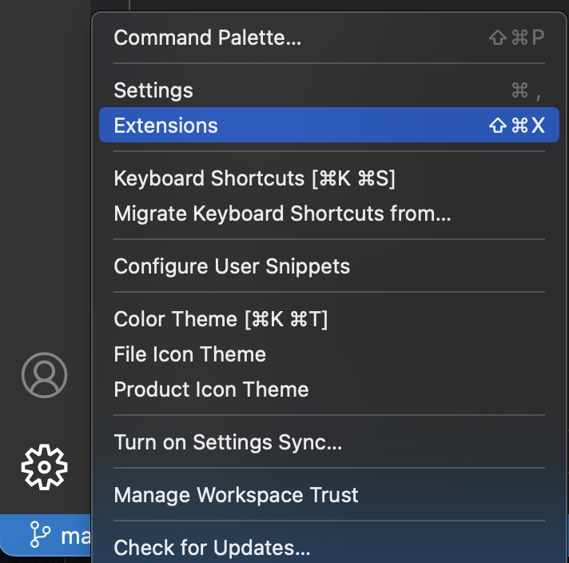
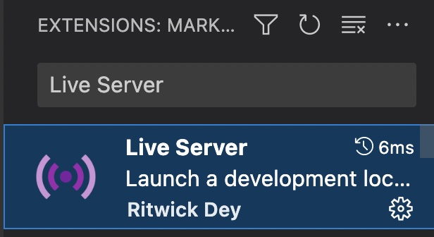

# Setting up a Developer Environment
In order to write the code that builds and renders your web maps you need a few things.

1. First and foremost, you'll need access to internet connection and a computer with an internet browser installed. The most recent version of [Google Chrome](https://www.google.com/chrome/) is the recommended browser for this workshop. 
<!-- 2. To work with Mapbox you must [sign up](https://account.mapbox.com/auth/signup/) for a free account and [create an access token](https://account.mapbox.com/access-tokens/).  -->
<!-- 3. Downloading the Mapbox GL JS graphics library requires running one simple command in your computer's terminal. If you have never worked in the terminal, consider browsing the Research Common's introductory workshop [here](https://ubc-library-rc.github.io/intro-shell/content/01-what-is-the-shell.html).-->
2. Second, you'll need an **access token** to use Mapbox's code libraries that power its web maps. To create your own access token, you generally would need to sign up for a free account. However, Mapbox will ask for your credit card information, even to create a free account. Therefore, this workshop provides an access token for you so you do not need to make an account at this time. When the **Hands On** section asks for an access token, use the token below. 

```
pk.eyJ1IjoibGlseWRlbWV0IiwiYSI6ImNsazcyZ25zdjAzemwzcm1ydnNybmkwb2EifQ.ggoNMtZ32x8wK-tGYFOCDg
```
{: .step}


2. Lastly, you'll need a [source code editor](https://en.wikipedia.org/wiki/Source_code_editor) for swift and efficient map construction. Much like a word processor helps with writing essays, a code editor makes writing code easier by formatting and color coding your work as you type. The workshop recommends [Visual Studio Code](https://code.visualstudio.com/download).

<!-- ## Create a Mapbox Account and Access Token
Mapbox's service model is based on a paid subscription, but they offer a free service tier for those interested in using their products for learning, with enough resources to get you started. Use of services is authorized on a user-basis by an **access token.** 

[Sign up](https://account.mapbox.com/auth/signup/) for a free Mapbox account using an email address you have access to (you will be asked to verify your email). 

[Create access token](https://account.mapbox.com/access-tokens/) by giving it a name (like mapbox-workshop) and scrolling to the end of the page where a button says **Create Token**. You will be prompted to confirm your site password. A new access token should appear under the default access token. Keep this browser window open as we will need the access token in a moment.  -->


### Setting up Visual Studio Code
It's helpful to see your web-map change as you work. Live Server is an extension for Visual Studio Code that builds a local server to host HTML documents in-progress. To install, first locate the Visual Studio Code application on your computer and open it. Then, click the gear icon in the bottom left corner of VS Code and go to **extensions**. Search for **"Live Server"** and install. 


<br>

