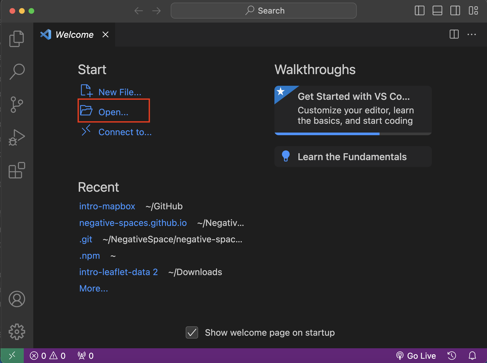
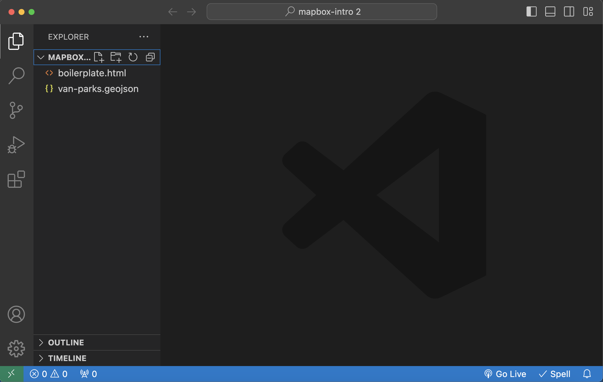

# Hands On
This section will guide you through building an interactive web map powered by Mapbox. To begin, we will look at the code that loads a basemap in order to understand what each element does. Next, we will add data to this basemap and, building upon the given code to create an interactive map visualizing public parks in the city of vancouver. Although Mapbox Studio provides a graphical user interface (GUI) for styling spatial data, this workshop will teach you to customize a map from within a source code editor. 

To Do  #1
{: .label .label-green }
All of the data for this workshop is free and openly available. However, to get started you'll need to download and save it to your computer. Click on the 'Download Data' button below to start the download. Once complete, **extract the contents of the .zip file**.

[Download Data](mapbox-intro.zip){: .btn .btn-blue }
    

    
    
    
To Do  #2
{: .label .label-green }
Open Visual Studio Code (VS Code). Open your unzipped `mapbox-intro` data folder with VS Code. Do not click into the folder, but rather select the entire folder to be opened with VS Code. Once opened, you should see two files in the Explorer panel of your code editor. These are the data file and the map boilerplate.  

    
