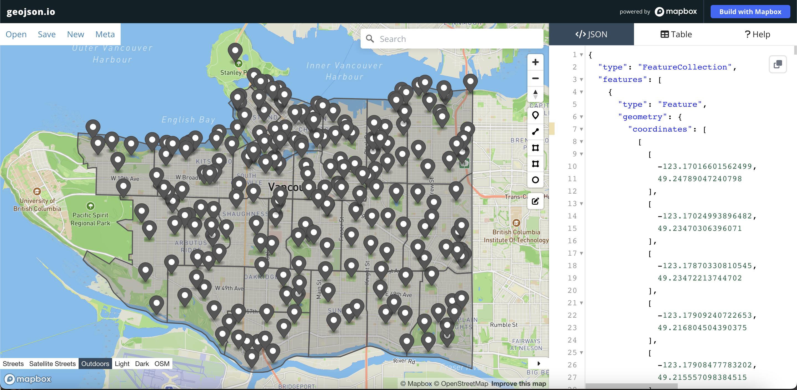

# Map Data
If you haven't already, click on the 'Download Data' button below to start the download. Once complete, **extract the contents of the .zip file**.
    
[Download Data](mapbox-intro.zip){: .btn .btn-blue }

Inside the workshop data folder you will see the boilerplate.html file we looked at earlier, as well as `van-parks.geojson` and `local-area-boundary.geojson`. Both are geospatial files downloaded from Vancouver's open data portal. [van-parks.geojson](https://opendata.vancouver.ca/explore/dataset/parks/map/?location=14,49.2717,-123.12271) contains points for 216 of vancouver's parks and [local-area-boundary.geojson](https://opendata.vancouver.ca/explore/dataset/local-area-boundary/map/?disjunctive.name&location=12,49.24898,-123.09168) contains polygons representing neighbourhood boundaries. Follow the links to view each dataset as a table or map in the open data portal.  

## GeoJSON
The vector layers or map tiles of your interactive basemap provide spatial context for the data you wish to spatially visualize. Your data is rendered on top of your chosen basemap and is called the "data layer", "map content" or sometimes "map features." Usually your data is vector data so you can click and interact with it, but you can also add raster data as well.      

If you’re a GIS user, you have encountered a Shapefile before. Shapefiles are the industry standard file type for geographic vector data. If you’ve ever tried to share a Shapefile in the web, you’ve probably had some problems, or needed to transform your file into something else. Shapefiles are meant to be used in GIS software and weren’t designed to be displayed in the web. The [GeoJSON](https://geojson.org/) format on the other hand is a geographic file type specifically meant for the web. GeoJSON files are “easy for humans to read, and easy for machines to read”, meaning that they’re a lightweight, simplified format so your average web browser can use them, and they’re also fairly easy to make sense of if you want to view and edit them in a code editor. Here’s a single point for a park in Vancouver in GeoJSON  format: 

```json
    {
      "type": "Feature",
      "geometry": {
        "type": "Point",
        "coordinates": [
          -123.108174,
          49.264334
        ]
      },
      "properties": {
        "parkid": 137,
        "official": 1,
        "hectare": 1.4,
        "neighbourhoodname": "Mount Pleasant",
        "facilities": "Y",
        "advisories": "N",
        "name": "Jonathan Rogers Park",
        "ewstreet": "W 7th Avenue",
        "specialfeatures": "N",
        "washrooms": "Y",
        "nsstreet": "Manitoba Street",
        "streetname": "W 7th Avenue",
        "streetnumber": 110,
        "googlemapdest": [
          49.264334,
          -123.108174
        ],
        "neighbourhoodurl": "https://vancouver.ca/news-calendar/mount-pleasant.aspx"
      }
    }
```
Even without prior GeoJSON knowledge, can you deduce the name of this park and whether or not it has washrooms? In contrast, a shapefile is a binary (0s and 1s, not text) format, so you wouldn't be able to read the file with human eyes. For these reasons, we're using GeoJSON files for this workshop.

One other great thing about GeoJSON, is that because they are open-source and simple to understand, there are several tools that allow you to create and edit them in the web, like [geojson.io](http://geojson.io).

To Do
{: .label .label-green }
1. Go to [geojson.io](http://geojson.io) and delete existing geoJSON text on the </>JSON panel.
2. Copy the GeoJSON text above and paste it into the blank the </>JSON panel. 
3. On the right-hand side of the map interface there is a vertical toolbar.Use the + icon from the map toolbar to zoom into the icon that for Jonathan Rogers Park you just added to the basemap.  Click on the pop-up to see the feature properties. Here you can add new information about the park, for instance, a personal_memory column. Use the edit button (at the bottom of the same toolbar) to drag the point to another location. 
4. Open [geojson.io](http://geojson.io) again in a new tab. Drag and drop first `local-area-boundary.geojson` then `van-parks.geojson` into the </>JSON panel. This is a quick and easy way to visualize the two geospatial datasets we'll use in this workshop. Now let's return to our boilerplate code and add today's data to the basemap.





