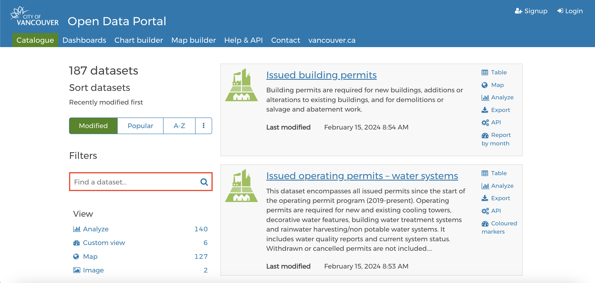
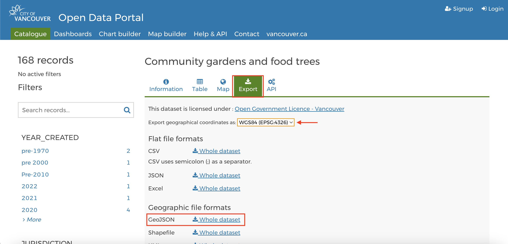
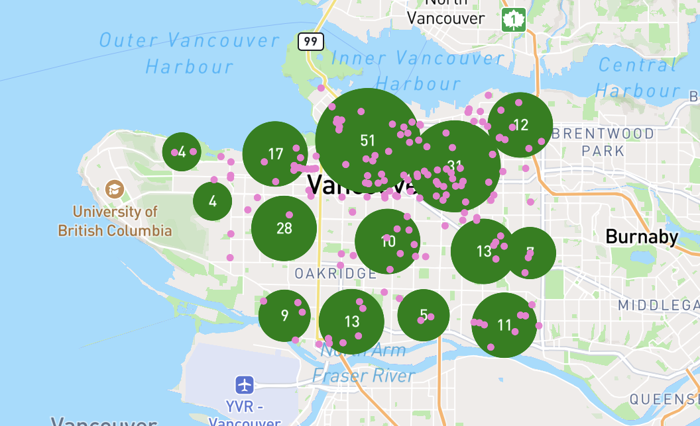

# Practice 

Practice choosing a dataset from Vancouver's open data portal, downloading it, and adding it to your map. Remember to specify geometry type when [adding sources](https://docs.mapbox.com/mapbox-gl-js/api/sources/#geojsonsource). Take a few minutes to try on your own or refer to the hints below. 


1. Go to Vancouver [open data portal](https://opendata.vancouver.ca/explore/?disjunctive.features&disjunctive.theme&disjunctive.keyword&disjunctive.data-owner&disjunctive.data-team&sort=modified)


2. Browse or filter for datasets, eg `Community gardens and food trees` 

3. Export data in geoJSON format. Keep projection set to WGS 84; web maps are projected in WGS 84 web mercator. 


4. Locate downloaded file on your computer and **move to workshop data folder** 

5. Add as a source **and** as a layer inside script tag and `map.on('load', () => {` function. If you downloaded Community gardens and food trees, see example below. Style your data as you'd like. 


```js
map.addSource('gardens', {
                type: 'geojson',
                data: './community-gardens-and-food-trees.geojson',
            });

            map.addLayer({
                'id': 'garden-markers',
                'type': 'circle',
                'source': 'gardens',
                'paint': {
                    'circle-color': '#f27ed3',
                    'circle-radius': 3
                }
            });
```


---  


That's that! Take a moment to browse Vancouver's open data catalogue while exploring Mapbox [Tutorials](https://docs.mapbox.com/help/tutorials/?product=Mapbox+GL+JS). What Mapbox skills interest you and what datasets might you use to practice? 